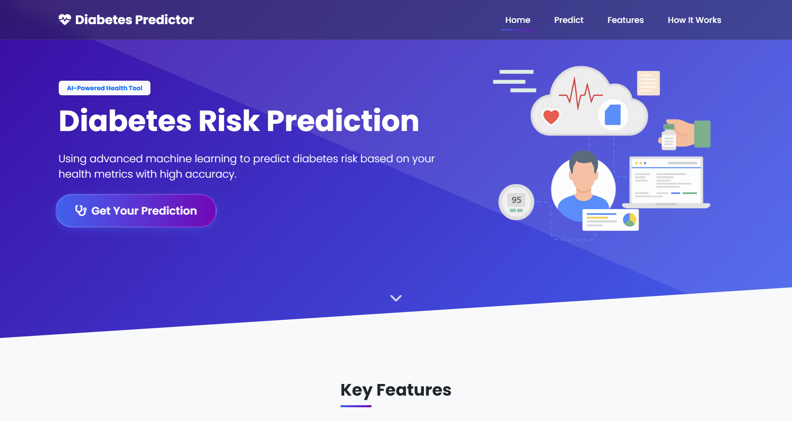
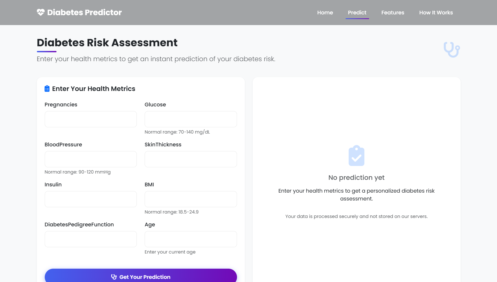

# Diabetes Prediction System


A machine learning-powered web application that predicts diabetes risk based on health metrics with high accuracy.

## Overview

This project uses advanced machine learning techniques to predict the likelihood of diabetes based on various health parameters. The system provides an intuitive web interface for users to input their health data and receive instant risk assessments.

## Features

- **High Accuracy Prediction**: Utilizes a Random Forest model with 80% accuracy
- **User-Friendly Interface**: Clean, responsive design for easy data input
- **Instant Risk Assessment**: Get immediate results with probability scores
- **Detailed Insights**: Personalized recommendations based on risk level
- **Mobile Responsive**: Access the tool from any device

## Screenshots

### Home Page


### Prediction Page


## Technology Stack

- **Backend**: Flask, Python
- **Machine Learning**: Scikit-learn, XGBoost, Pandas, NumPy
- **Frontend**: HTML, CSS, Bootstrap 5, JavaScript
- **Data Processing**: Advanced preprocessing with KNN Imputation, SMOTE for class imbalance

## Model Information

The system uses a Random Forest classifier that was selected after comparing multiple models:

| Model | ROC AUC | Accuracy |
|-------|---------|----------|
| RandomForest | 0.834 | 0.747 |
| XGBoost | 0.811 | 0.773 |
| SVM | 0.807 | 0.727 |
| LogisticRegression | 0.798 | 0.708 |

The model incorporates feature engineering techniques including:
- BMI categorization
- Age grouping
- Glucose level categorization
- Interaction features (BMI × Age, Glucose × Insulin)
- Log transformations for skewed features

## Dataset

The project uses the Pima Indians Diabetes Database from Kaggle, which includes several medical predictor variables and one target variable, `Outcome`. Predictor variables include:

- Pregnancies
- Glucose levels
- Blood pressure
- Skin thickness
- Insulin
- BMI
- Diabetes pedigree function
- Age

## Getting Started

### Prerequisites
- Python 3.8+
- pip package manager

### Installation

1. Clone this repository:
   ```bash
   git clone https://github.com/amangupta143/Diabetes-Prediction-System.git
   cd Diabetes-Prediction-System
   ```

2. Install required dependencies:
   ```bash
   pip install -r requirements.txt
   ```

3. Run the Flask application:
   ```bash
   python app.py
   ```

4. Open your browser and navigate to:
   ```
   http://localhost:5000
   ```

## How It Works

1. **Input Your Health Data**: Enter basic health metrics like glucose levels, blood pressure, BMI, and more.
2. **AI Analysis**: Our machine learning model processes your data and calculates your diabetes risk.
3. **Get Your Results**: Receive an instant assessment with a detailed breakdown of your risk factors.

## Model Training

If you want to retrain the model with new data or different parameters:

```bash
python model-trainer.py
```

This script handles:
- Data cleaning and preprocessing
- Feature engineering
- Model selection and hyperparameter tuning
- Model evaluation and comparison
- Saving the best model for the web application

## Contributing

Contributions are welcome! If you have ideas for improvement, bug fixes, or want to explore different aspects of the model, feel free to:

1. Fork the repository
2. Create a feature branch (`git checkout -b feature/amazing-feature`)
3. Commit your changes (`git commit -m 'Add some amazing feature'`)
4. Push to the branch (`git push origin feature/amazing-feature`)
5. Open a Pull Request

## License

This project is licensed under the MIT License - see the LICENSE file for details.

---


Made with ❤️ by [Aman Gupta](https://github.com/amangupta143)

[](https://amangupta.me)
[](https://github.com/amangupta143)
[](https://www.linkedin.com/in/amangupta143/)